# Strawberry Tidal Tools

Ce projet permet de convertir des playlists Tidal en playlists compatibles Strawberry, puis d'automatiser l'enregistrement (ripping) des morceaux lus dans Strawberry, quel que soit le service de streaming utilisé.

## Fonctionnalités principales

- **Authentification Tidal** : Connecte Strawberry à Tidal via OAuth et injecte les tokens dans la configuration de Strawberry.
- **Conversion de playlists** : Convertit une playlist Tidal en fichier `.xspf` compatible Strawberry.
- **Ripping automatisé** (fonctionne avec Audacity via pipe) : Deux modes de rip automatisé depuis Strawberry :
  - **Ripper général (strawberry_ripper.py)** :
    - Enregistre tous les morceaux joués dans une playlist chargée dans Strawberry.
    - Fonctionne avec n'importe quel flux supporté par Strawberry (Tidal, Qobuz, fichiers locaux, etc.), du moment que la playlist est chargée.
    - Suit automatiquement les changements de piste.
  - **Ripper par playlist XSPF (tidal_xspf_ripper.py)** :
    - Prend un fichier `.xspf` (généré par le converter).
    - Charge chaque morceau un par un dans Strawberry, attend la pochette, lance l'enregistrement, puis passe au suivant.
    - Idéal pour ripper une playlist Tidal complète automatiquement.

## Workflow recommandé

1. **Authentification Tidal**
   ```bash
   python3 connectStrawberry2tidal.py
   ```
   Suivre les instructions pour connecter ton compte Tidal à Strawberry.

2. **Conversion d'une playlist Tidal**
   ```bash
   python3 tidal_playlist_converter.py <URL_playlist_Tidal>
   ```
   Génère un fichier `NOM-DE-LA-PLAYLIST.xspf`.

3. **Ripping des morceaux**
   - **Mode général (playlist déjà chargée dans Strawberry)** :
     ```bash
     python3 strawberry_ripper.py
     ```
     Lance la lecture de la playlist dans Strawberry. Le script enregistre chaque morceau joué.

   - **Mode XSPF (ripping automatique d'une playlist Tidal)** :
     ```bash
     python3 tidal_xspf_ripper.py NOM-DE-LA-PLAYLIST.xspf
     ```
     Le script charge chaque morceau dans Strawberry et l'enregistre automatiquement.

## Illustrations du workflow

### 1. Connexion de Strawberry à Tidal

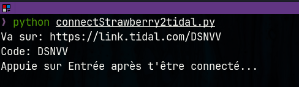
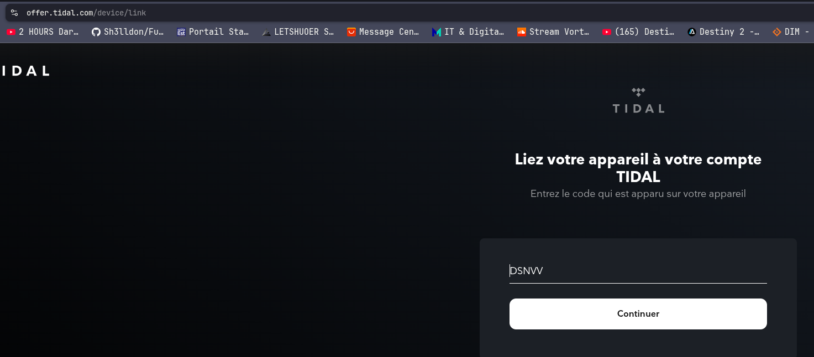
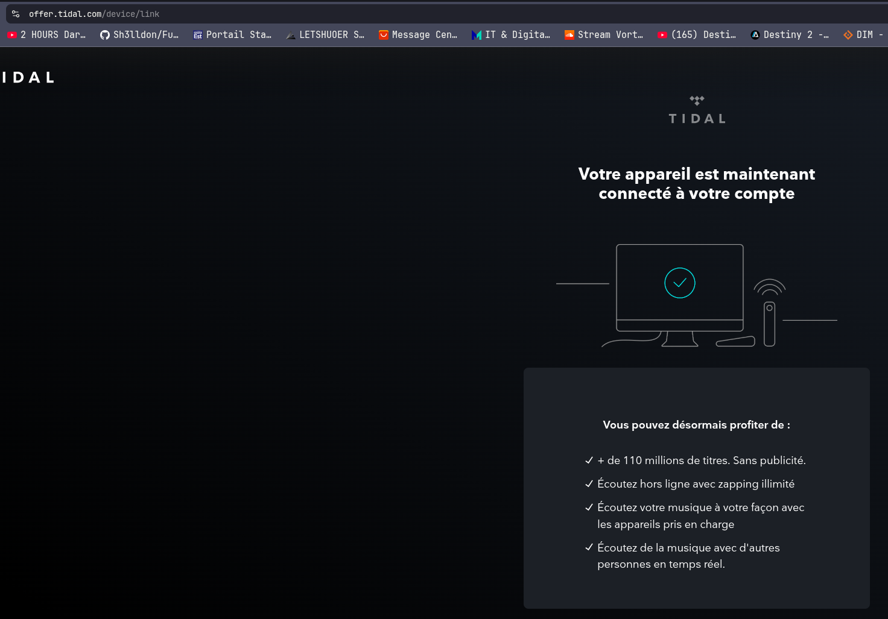
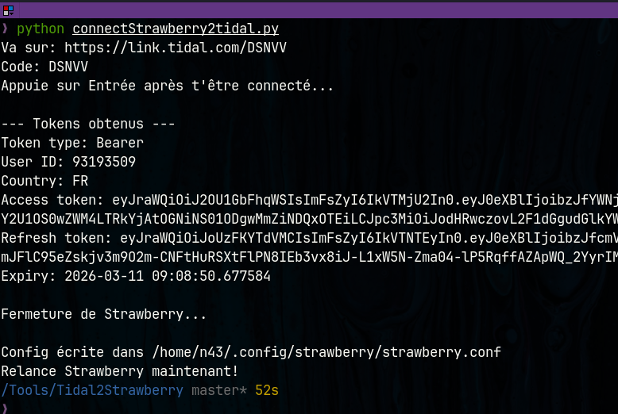

### 2. Configuration de Strawberry

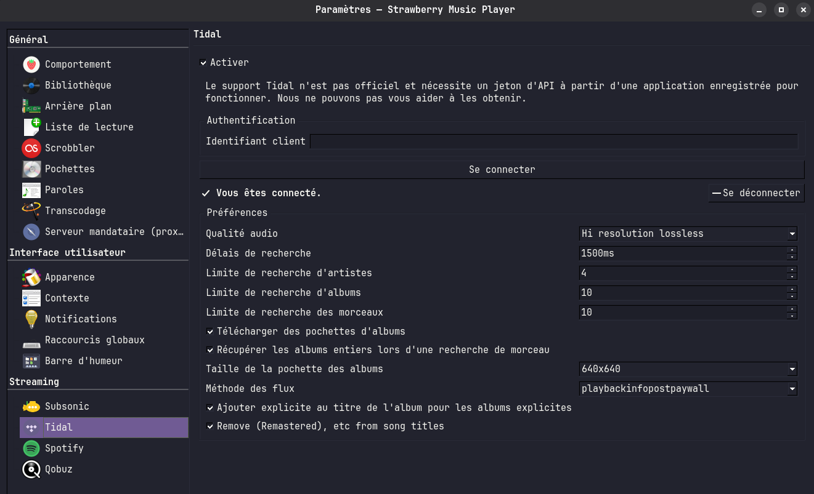
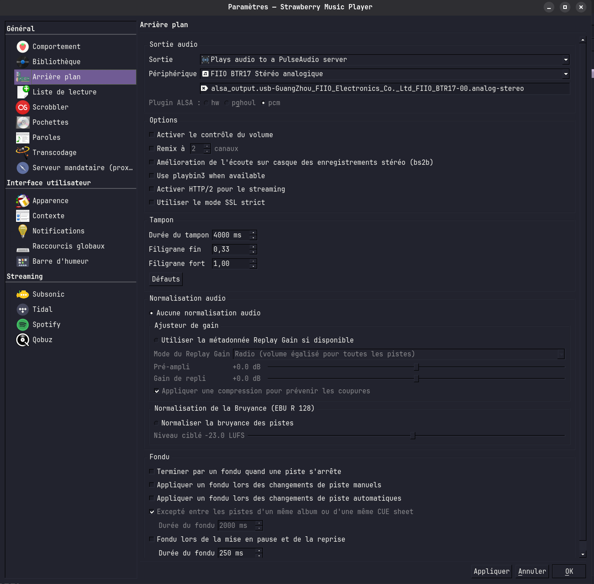

**Points essentiels pour la configuration :**

- **playbacinfopostaywall** :
  - Active impérativement l'option `playbacinfopostaywall` dans Strawberry (Préférences > Lecture > Avancé).
  - Cela permet à Strawberry de publier les informations de lecture sur DBus même si la fenêtre est en arrière-plan, ce qui est indispensable pour que le ripper détecte correctement les changements de piste.

- **Périphérique de sortie audio** :
  - Choisis explicitement le périphérique de sortie audio dans les paramètres audio de Strawberry (Préférences > Lecture > Périphérique de sortie).
  - Assure-toi que le périphérique sélectionné correspond à celui utilisé par Audacity pour l'enregistrement, afin d'éviter tout problème de capture du son.

### 2bis. Configuration d'Audacity (script pipe)

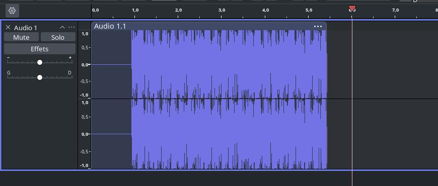
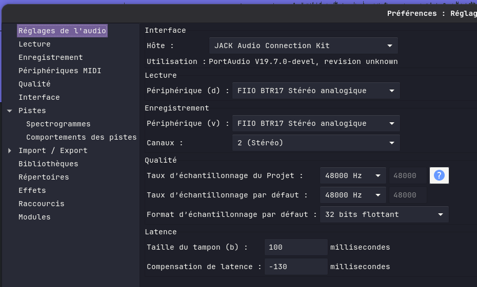
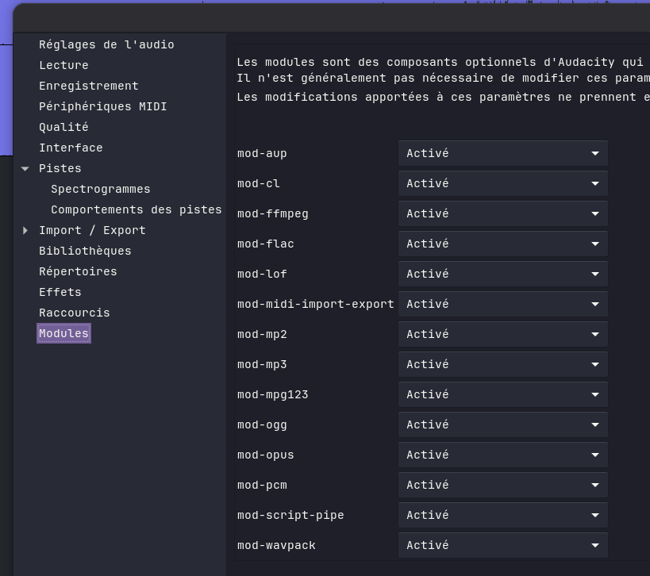

**Points essentiels pour Audacity :**

- Installe impérativement le module `mod-script-pipe` pour Audacity (souvent disponible dans les options d'installation avancées ou via les paquets additionnels).
- Vérifie que le module est bien activé (menu Outils > Modules > mod-script-pipe doit être sur "Activé").
- Redémarre Audacity après activation.
- Le script pipe permet aux ripper de piloter Audacity automatiquement, sans intervention manuelle.

*Sans mod-script-pipe, aucune automatisation n'est possible !*

### 3. Conversion de playlist Tidal

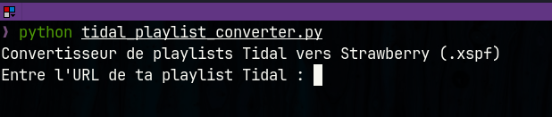
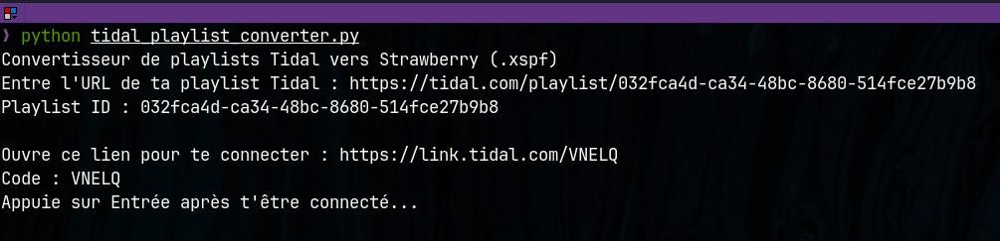
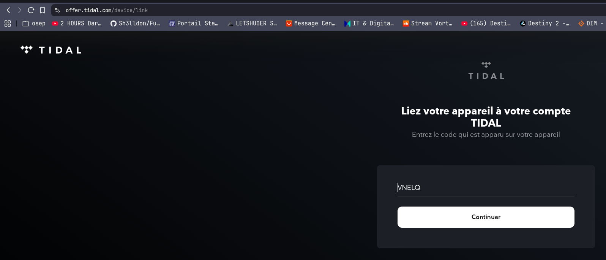
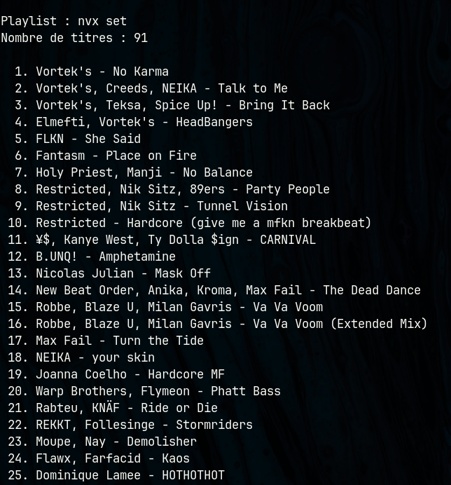

### 4. Ripping automatique

**Mode XSPF (ripping automatique d'une playlist Tidal)**

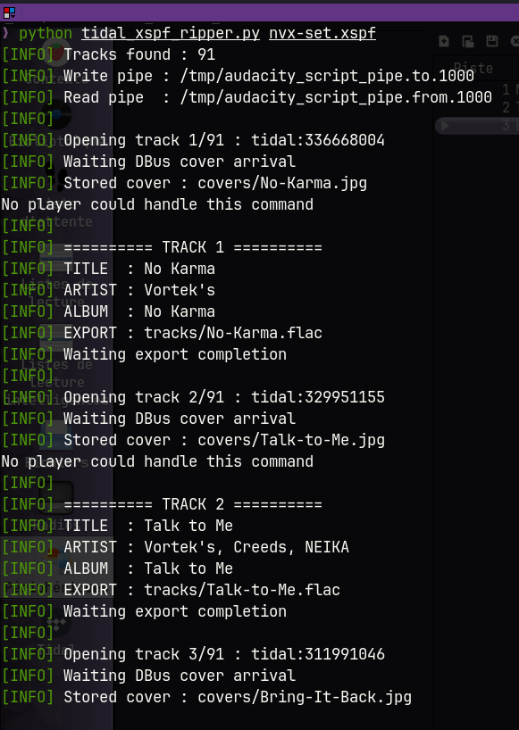
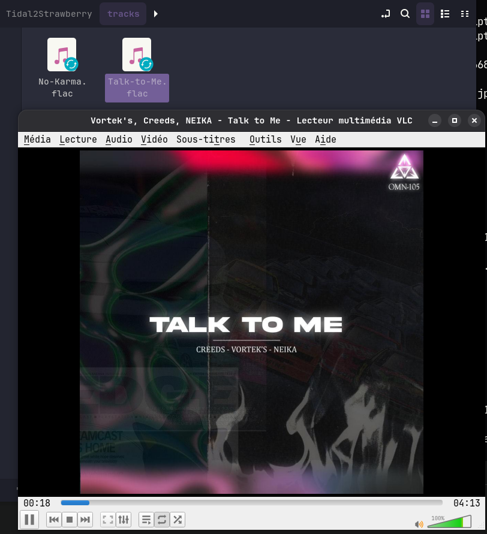

*Lors de l'export de chaque morceau, les métadonnées (titre, artiste, album) sont automatiquement injectées dans le fichier FLAC, ainsi que la pochette d'album (si disponible). Les fichiers générés sont donc parfaitement tagués et illustrés dans ta bibliothèque musicale.*

## Différences entre les deux ripper

- **strawberry_ripper.py**
  - Récupère les morceaux depuis une playlist déjà chargée dans Strawberry.
  - Fonctionne avec n'importe quelle source supportée par Strawberry (Tidal, Qobuz, fichiers locaux, etc.).
  - Suit les changements de piste automatiquement.
  - Idéal pour ripper une session d'écoute ou une playlist manuellement chargée.
   - Fonctionne en automatisant Audacity via le script pipe (aucune intervention manuelle dans Audacity).

- **tidal_xspf_ripper.py**
  - Récupère les morceaux depuis un fichier `.xspf` généré à partir d'une playlist Tidal.
  - Charge chaque morceau un par un dans Strawberry, puis l'enregistre.
  - Plus automatisé pour ripper une playlist Tidal complète sans intervention.
   - Utilise également Audacity via pipe pour automatiser l'enregistrement de chaque piste.

  - Lors de l'export de chaque morceau, les **métadonnées** (titre, artiste, album) sont automatiquement injectées dans le fichier FLAC, ainsi que la **pochette d'album** (si disponible). Cela permet d'avoir des fichiers parfaitement tagués et illustrés dans ta bibliothèque musicale.

## Prérequis

- Python 3
- [tidalapi](https://github.com/tamland/python-tidal)
- [playerctl](https://github.com/altdesktop/playerctl)
- [metaflac](https://xiph.org/flac/documentation_tools_flac.html)
- Strawberry Music Player
- Audacity (avec script pipe activé)

## Dossiers générés

- `tracks/` : Contient les fichiers audio exportés (FLAC).
- `covers/` : Contient les pochettes extraites.

## Métadonnées et pochettes

Chaque fichier FLAC exporté contient automatiquement :

- **Les métadonnées** (titre, artiste, album) injectées dans le fichier audio.
- **La pochette d’album** intégrée dans le FLAC (si disponible), pour un affichage optimal dans les lecteurs compatibles.

Cela garantit que les morceaux exportés sont parfaitement identifiés et illustrés dans ta bibliothèque musicale.

## Auteurs

- 49-3
